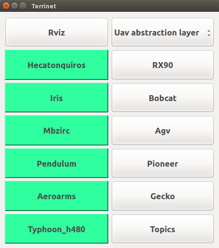
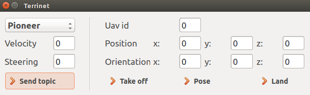

# Terrinet simple framework

## Installation needs
`sudo apt-get install ros-kinetic-ackermann-msgs`

`sudo apt-get install ros-kinetic-robotnik-msgs`

`sudo apt-get install ros-kinetic-moveit-core`

`sudo apt-get install ros-kinetic-visual-tools`

`sudo apt-get install ros-kinetic-moveit-ros-planning-interface `

`sudo apt-get install ros-kinetic-mavros`

`sudo apt-get install python-jinja2`

`sudo apt-get install ros-kinetic-ardrone-autonomy `

`sudo apt-get install ros-kinetic-ros-control`

`sudo apt-get install ros-kinetic-robotnik-sensors`

`sudo apt-get install ros-kinetic-gazebo-ros-control`

`sudo apt-get install ros-kinetic-twist-mux`

`sudo apt-get install ros-kinetic-joint-state-controller`

`sudo apt-get install ros-kinetic-moveit`

`sudo apt-get install ros-kinetic-effort-controllers`

`sudo apt-get install ros-kinetic-position-controllers`

`sudo apt-get install ros-kinetic-velocity-controllers`

`sudo apt-get install ros-kinetic-navigation`

`sudo apt-get install ros-kinetic-hokuyo3d`

https://github.com/Derecho/libserial (and install it)

## Gazebo models

Copy this gazemo models into home/$USER/.gazebo/models

git clone https://github.com/luismarzo/Gazebo-models.git

## Install ual

https://github.com/grvcTeam/grvc-ual/wiki/How-to-build-and-install-grvc-ual

`sudo apt-get install libeigen3-dev ros-kinetic-mavros ros-kinetic-mavros-extras ros-kinetic-geodesy ros-kinetic-joy`

`sudo apt-get install protobuf-compiler python-jinja2 python-pip`

`sudo pip install numpy toml`

`sudo geographiclib-get-geoids egm96-5`

## Install firmware

` cd ~/catkin_ws/src `

` git clone --recursive https://github.com/PX4/Firmware.git`

` cd Firmware`

` git checkout -f v1.7.3`

` git submodule update --recursive`

## Usage 

-->Currently Hecatonquiros and rx90 are stand alone robots. They have their owns configurations and gazebo maps for diferent purpose demos.

-->If you want to use mobile robots and some uavs, YOU SHOULD START FISRT THE UAVS. We are having issues with them (we are fixing it)

-->Don't forget to add the directory in the .bashrc

To launch the gui, write:
` rosrun terrinet terrinet `

A first gui should open, you will see just this:

On the left you have uavs from the grvc ual repo, and you can alternate between the px4 configuration and the uav_abstraction layer.

On the left, you have the rest of the robots.

Each time you click on a robot, a terminal will appear and Gazebo will start. Do not close this terminals, because each terminal corresponds to the processes associated with each robot.

Secondly, if you want to move them, you can do it trough rostopic list. However, for the uavs you will have to use rosservice method, the same way that you will move it in the grvc ual repo. 

But, it is easier to move it with the topic buttom, and a second gui will appear.

On the left you can choose the bobcat, pioneer, agv or gecko to move them.

On the right you can move the uavs. First, you have to choose the id of the uav and use the "take off" buttom. Later, you can senf them poses.

## Others

You can follow the bobcat robot with the mbzirc. Fist , initialize the mbzirc, next the bobcat and make the uavs to take off. Next run in a terminal:

` rosrun heca_plugins follow_bobcat `

The gecko and move the camera in horizontal and vertical ways, just use:
` rosrun gecko_control gecko_teleop `

The bobcat can do Slam in simulation, and the pioneer Slam in simulation and reality with a raspberry pi, for them just go to [here](https://github.com/luismarzo/Agv_and_Bobcat/tree/master/bobcat) for the Bobcat and [here](https://github.com/luismarzo/pioneer_rgbslam) for the pioneer.

